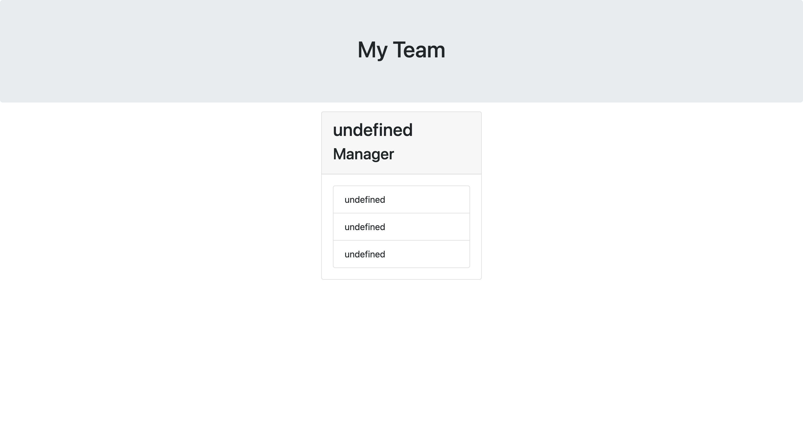

# Team Profile Generator

## Video

## Description

I wanted to generate a webpage that displays my team's basic info for easy access to their emails and GitHub profiles.

## Table of Contents

-[Installation](#installation)
-[Usage](#usage)
-[Questions](#questions)

## Installation

Must have node.js installed on your computer. You can install this in your terminal by running npm i to install. Once installed you should now see a package.json file in your folder.

## Usage

Create a team generator as shown below:

## Questions

[gitHub](https://github.com/JosieMald)

For more information regarding this generator you can contact me at:

JosieLindaMaldonado@gmail.com
